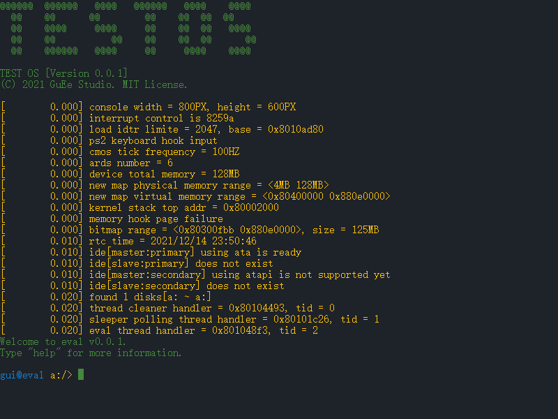
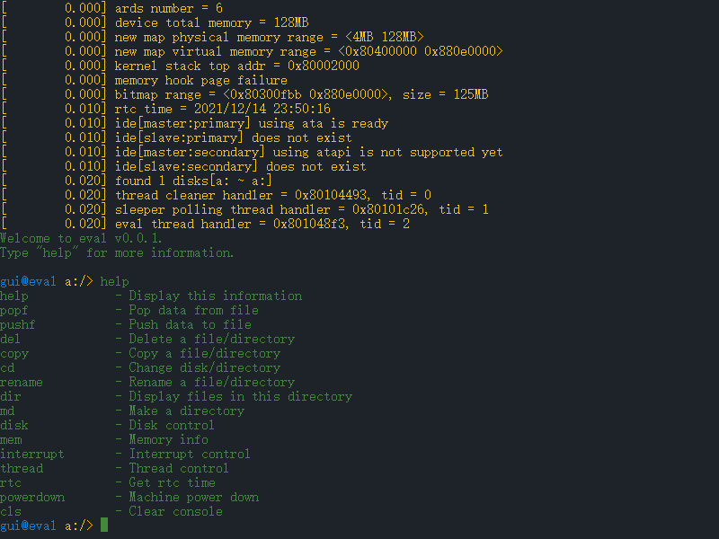
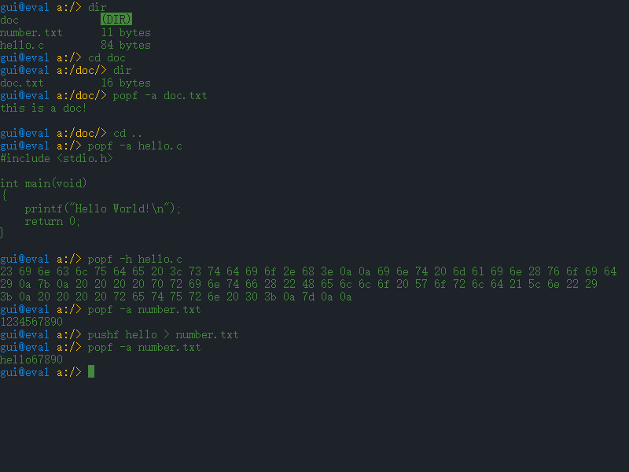

# TEST OS

i386 架构下的教学型内核，MIT 许可，版本 0.0.1。项目体量小，功能聚焦在启动、内存、线程、FAT32 与交互式 Shell，适合学习操作系统基础原理。

## 环境要求

| 工具 | 用途 |
|------|------|
| NASM | 引导程序与内核汇编 |
| GCC（32 位） | 内核 C 代码编译 |
| GNU LD | 链接 ELF 内核 |
| QEMU i386 | 运行与调试 |
| dd / qemu-img | 制作启动镜像 |

### Linux

```bash
# Arch / Manjaro 示例
sudo pacman -S nasm gcc qemu-system-x86

# 若已安装 x86_64-elf 交叉工具链，可直接 make
make TEST-OS.img

# 否则使用本机 gcc -m32（Makefile 已支持 -m32）
make TEST-OS.img CROSS_COMPILE=
```

### Windows

建议使用 WSL、MSYS2 或 Cygwin，并安装 NASM、可生成 ELF 的 GCC、QEMU。

## 快速开始

```bash
# 仅编译镜像（不启动 QEMU）
make TEST-OS.img CROSS_COMPILE=

# 编译并运行（默认 make all 会启动 QEMU）
make run CROSS_COMPILE=

# GDB 调试（需 GDB_MODE=y）
make gdb CROSS_COMPILE= GDB_MODE=y

# 清理
make clean
```

首次运行会自动创建 `FAT-FS.img`（64MB IDE 数据盘）。在 Shell 中格式化：

```
disk -f fat32 a:
```

## 文档

| 文档 | 内容 |
|------|------|
| [doc/architecture.md](doc/architecture.md) | 启动流程、内存布局、模块划分 |
| [doc/commands.md](doc/commands.md) | eval Shell 命令参考 |
| [doc/fat32.md](doc/fat32.md) | FAT32 路径约定与读写说明 |
| [doc/thread.md](doc/thread.md) | 线程 API 示例 |

## 运行效果





## 许可

MIT License — 见 [LICENSE](LICENSE)
